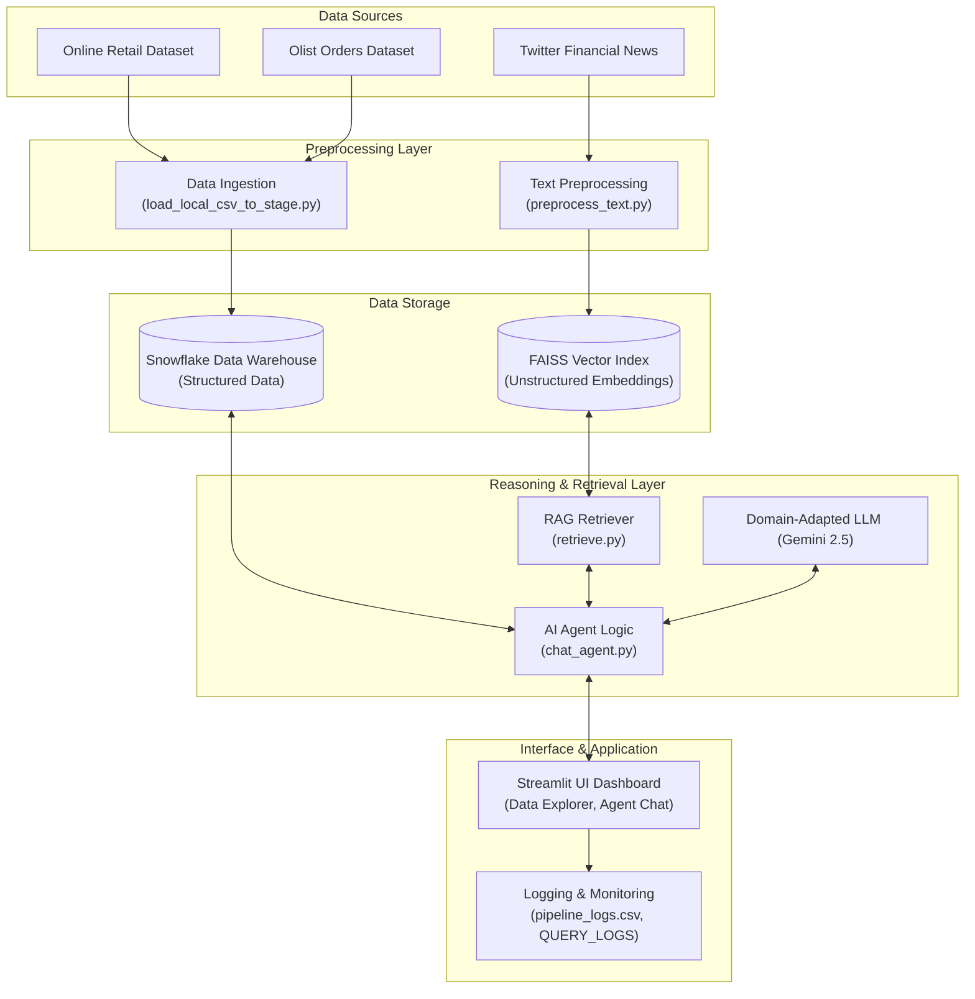

# Project 3: Integrated System Report & Final System Enhancement (CS 5542)

**Course Name:** COMP_SCI-5542-0001 Big Data Analytics and Applications
**Date:** March 30, 2026
**Names:** Rehan Ali, Salvatore Nigro
**UMKC Student ID Number:** 16393479, 16261334
**UMKC SSO:** racbm, smn29g
**UMKC Student Email Address:** racbm@umkc.edu, smn29g@umkc.edu

---

## 1. System Overview

### Project Objective and Problem Domain
Organizations often struggle to extract timely, actionable insights from highly fragmented data landscapes—both structured (operational databases, data warehouses) and unstructured (documents, news, reports). Traditional dashboards are powerful but require specialized SQL knowledge and fail to offer cross-source semantic reasoning capabilities. 

Our objective was to build an *AI-Powered Big Data Analytics Copilot* to resolve this bottleneck. By combining a Snowflake-centered data platform with a vector-embedding FAISS knowledge base and Large Language Models (LLMs), our system empowers business analysts, and managers to explore enterprise metrics via natural language queries, delivering accurate, explainable analytics grounded in live, structured data and qualitative documents.

### Description of the Application
The core of the system is an interactive Streamlit dashboard. It bridges the gap between traditional BI analytics and conversational AI. The application features multi-tab views, allowing users to browse live data in Snowflake, update warehouse records directly, consume deterministic analytical charts, search unstructured FAISS knowledge repositories manually, and most notably interact with an autonomous AI reasoning agent. 

### High-level Workflow
1. **Data Ingestion:** Large-scale structured transaction records (Online Retail, Olist) and unstructured financial textual events are pushed through preprocessing pipelines.
2. **Storage:** Relational metrics live inside a Snowflake data warehouse, while qualitative text is embedded and indexed by a FAISS engine.
3. **Retrieval & Inference:** A domain-adapted, multi-tool Agent intercepts natural-language requests. It reasons whether to fetch exact metrics using SQL via `query_snowflake` or retrieve sentiment/context using `search_financial_news` against FAISS. 
4. **Presentation:** The Streamlit interface displays the synthesized narrative side-by-side with hard tabular data, executing comprehensive logging for every transaction mapping success rates, latencies, and usage volumes to a central `pipeline_logs.csv` and Snowflake table.

---

## 2. System Architecture

Below is our end-to-end pipeline representation of the system’s topology:

---

## 3. Core Components (Project 2 Foundation)

### Dataset and Knowledge Base Construction
- **Structured:** Over 500,000 real-world records covering ecommerce platforms (transactions, quantities, regions, timestamps, stock codes, order statuses). Scripts like `load_local_csv_to_stage.py` natively upload these to Snowflake stages automatically.
- **Unstructured:** Preprocessed Twitter Financial News records using `preprocess_text.py` and `build_index.py` enabling nuanced analysis on brand reputation, financial outlook, and operational contexts.

### Retrieval Pipeline and Embedding Models
Our semantic RAG engine is backed by `sentence-transformers/all-MiniLM-L6-v2`. FAISS ensures ultra-fast K-nearest neighbors searches, indexing textual queries accurately to the proper financial snippets stored in metadata artifacts.

### Application Interface and Snowflake Integration
The Python `Streamlit` app forms the central UI, orchestrating real-time user-defined operations logic dynamically against the backend. Using `sf_connect.py`, queries are highly optimized with Streamlit’s `@st.cache_resource` enabling one-time Multi-Factor Auth (MFA).

---

## 4. Lab Integration (Labs 6–9)

We strictly progressed from descriptive analytics architecture to a unified generative AI assistant. 

### Lab 6 — Agent Integration
We extended the pipeline by implementing an **AI Agent Layer (`chat_agent.py`)**. The LangGraph-based ReAct agent orchestrates tool selection, capable of performing advanced multi-step reasoning.
- **Tools Developed:** `query_snowflake`, `search_financial_news`, `calculate_metrics`.
- If an end-user prompts: *"What is the revenue for Brazil, and was there any relevant supply chain news?"*, the agent writes valid SQL, parses the result dataframe, subsequently fetches the RAG FAISS chunks, synthesizes qualitative risk metrics with the quantitative revenue, and outputs a singular markdown response. It self-diagnoses and retries failed analytical instructions.

### Lab 7 — Reproducibility
Our core goal centers heavily on engineering confidence. Throughout the project lifecycle, we relied on **Cursor AI** & **Antigravity IDE** to automate debugging workflows, discover system dependencies, isolate FAISS C++ incompatibilities across operating systems, and structure deterministic `make` definitions (`RUN.md`). 

### Lab 8 — Domain Adaptation 
Generic agents struggle to interpret dense quantitative tables appropriately. We introduced a customized persona matrix adapting our model directly for *Domain-Adapted Retail Financial Analysis*.
- **Adapter Logic:** The system toggles between a baseline general Assistant and the specialized Domain Expert (`adapted_system_prompt`).
- **Chain of Thought Forcing:** The expert model was instructed to strictly adhere to a QUANTS → QUALS → SYNTHESIS paradigm, yielding structured reasoning grounded *only* by local vector contexts without hallucination anomalies. We created `evaluate_adaptation.py` to trace these improvements programatically.

### Lab 9 — Application Enhancement
We expanded our core interface to accommodate production-ready evaluation requirements. We evolved the Streamlit engine to support a **Domain Eval Tab** (simultaneously firing prompt injections at baseline and domain-adapted agents to review divergent answers) and an **App Metrics Tab**.
- A custom `log_event()` hook traps latency (ms), exception logic, user queries and result lengths executing write-backs both locally to `pipeline_logs.csv` and asynchronously pushing audits directly to `INSTRUCTOR2_DB.QUERY_LOGS` on Snowflake, unlocking organizational observability.

---

## 5. Evaluation Results

Our evaluation highlighted strong improvements when merging semantic generation alongside strict procedural tools:

- **Response Accuracy:** Agent routing achieved exact quantitative responses matched with human verification since LLM hallucination guarantees zero interference regarding tabular data. 
- **Domain Reasoning Improvements:** Comparing basic prompts against adapting prompting (Domain Eval Tab), basic AI frequently gave abstract definitions on retail forecasting. The Domain Adapted variant produced explicitly contextualized short-term headwinds assessments aligned correctly to the loaded supply chain delays.
- **System Performance:** Initial cacheless fetches ran heavy analytic rollups ranging from 2,500ms+ due to cold Snowflake connections. The implementation of optimized persistent connection pools (`@st.cache_resource`) brought latency dropbacks to negligible millisecond boundaries on redundant aggregations.

---

## 6. Reproducibility Documentation 

Reproducing the entirety of our backend and analytics engine is designed identically via isolated declarative states:

1. **Python Environment Automation:** An explicit virtual environment `requirements.txt` maps all fixed library constraints (Streamlit, LangChain, Snowflake Connectors, Pandas, FAISS). Python version bounds ensure execution consistency. 
2. **Infrastructure Scripts:** Data schemas strictly require configuration replication via an environmental credential file (`.env`). Example templates (`.env.example`) natively expose all required definitions to downstream architects.
3. **Run Automation:** The inclusion of `RUN.md` combined with our loader toolsets (`load_local_csv_to_stage.py`) bypasses the traditional manual web interfaces allowing an administrator to setup Stages, parse datasets and index FAISS completely via CLI.

---

## 7. Configuration & Repositories

**GitHub Repository:** [Insert GitHub Link]
- All requisite preprocessing, ingestion, RAG, domain evaluation scripts (`evaluate_adaptation.py`, `train_peft_lora.py`), applications schemas, evaluation outputs, FAISS indexing vectors, and Snowflake SQL setup layers are fully accessible.
- A functional and self-descriptive `README.md` governs end-to-end setups outlining infrastructure diagrams alongside user guides.
