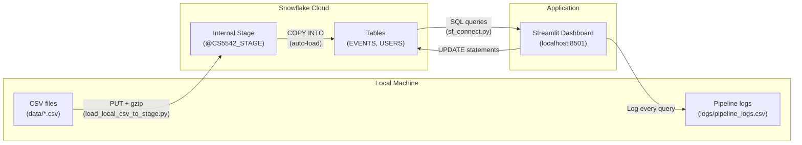
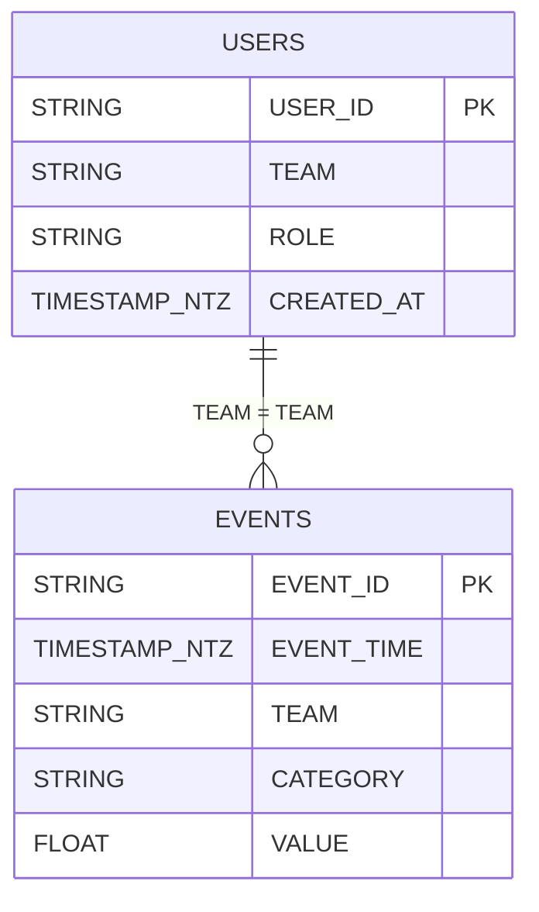
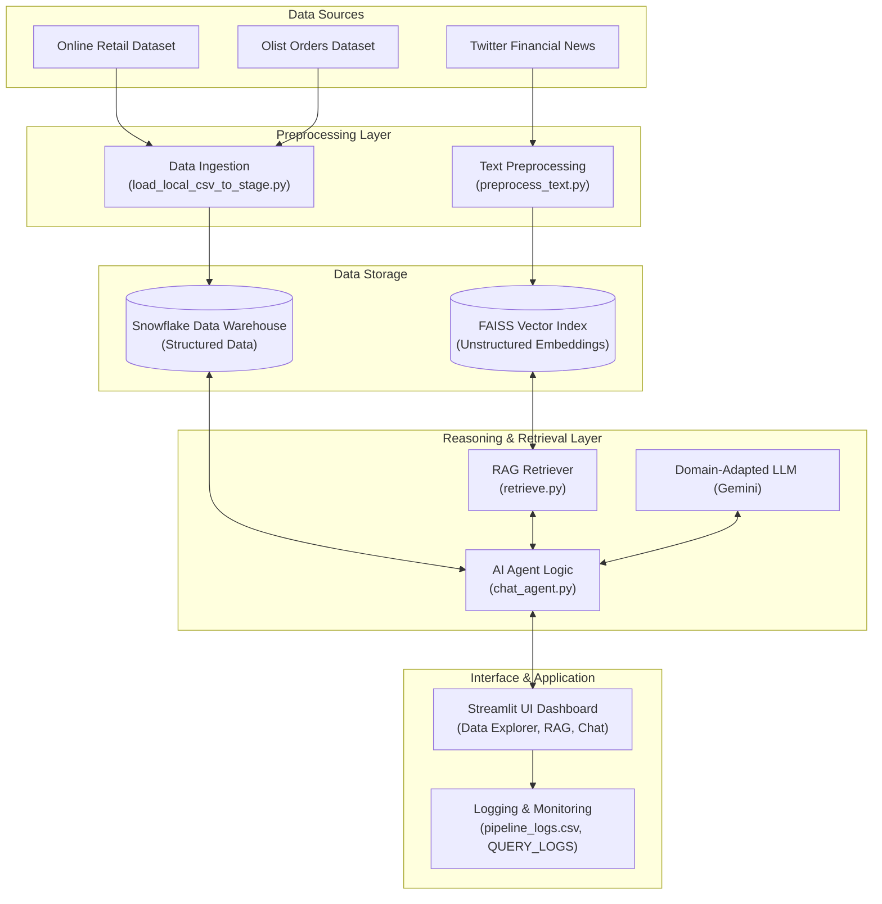

# CS 5542 — Week 5 Snowflake Integration Starter

> A complete **Data → Snowflake → Query → Dashboard → Logging** pipeline built with Python, Snowflake, and Streamlit.

---

## Table of Contents

1. [Project Overview](#project-overview)
2. [Architecture & Data Flow](#architecture--data-flow)
3. [Project Structure](#project-structure)
4. [File-by-File Explanation](#file-by-file-explanation)
5. [Database Schema](#database-schema)
6. [Sample Data](#sample-data)
7. [Prerequisites](#prerequisites)
8. [Dependencies](#dependencies)
9. [Setup Guide (Step-by-Step)](#setup-guide-step-by-step)
10. [Authentication](#authentication)
11. [Running the Pipeline](#running-the-pipeline)
12. [Streamlit Dashboard](#streamlit-dashboard)
13. [SQL Scripts Reference](#sql-scripts-reference)
14. [Troubleshooting](#troubleshooting)
15. [Week 5 Scope](#week-5-scope)
16. [Extensions Completed](#extensions-completed)
17. [Demo Video Link](#demo-video-link)
18. [Notes / Bottlenecks](#notes--bottlenecks)

---

## Project Overview

This project demonstrates a complete data engineering pipeline using **Snowflake** as the cloud data warehouse:

1. **Load** — Local CSV files are uploaded to a Snowflake internal stage (PUT) and loaded into tables (COPY INTO).
2. **Query** — Analytical SQL queries aggregate, filter, and join the data.
3. **Visualise** — An interactive Streamlit dashboard displays query results with Altair charts.
4. **Update** — The dashboard supports live record updates (UPDATE statements via UI).
5. **Monitor** — Every query execution is logged to a local CSV file for auditing.

---

## Architecture & Data Flow



**How it works:**
1. `load_local_csv_to_stage.py` reads a local CSV, uploads it to Snowflake's internal stage using PUT (auto-compressed to gzip), then runs COPY INTO to load rows into the target table.
2. `streamlit_app.py` connects to Snowflake, runs analytical queries, renders results in scrollable tables and bar charts, and supports live record updates.
3. Every query execution is appended to `logs/pipeline_logs.csv` with timestamp, team, user, latency, row count, and error (if any).

---

## Project Structure

```
cs5542-week5-snowflake-starter/
│
├── .env                            # Your Snowflake credentials (git-ignored, never commit)
├── .env.example                    # Template — copy to .env and fill in your values
├── .gitignore                      # Excludes .env, __pycache__, .pyc, logs
├── requirements.txt                # All Python dependencies
├── README.md                       # This handbook
├── CONTRIBUTIONS.md                # Team member accountability tracker
│
├── data/                           # Sample CSV datasets
│   ├── events.csv                  # 5 event records (search, upload, analysis)
│   └── users.csv                   # 4 user/team records
│
├── sql/                            # Snowflake SQL scripts (run in order)
│   ├── 01_create_schema.sql        # Creates database, schema, and tables
│   ├── 02_stage_and_load.sql       # Creates warehouse, file format, and stage
│   └── 03_queries.sql              # Example analytical queries
│
├── scripts/                        # Python automation scripts
│   ├── sf_connect.py               # Centralised Snowflake connection helper
│   └── load_local_csv_to_stage.py  # CSV → Stage → COPY INTO loader
│
├── app/                            # Streamlit web application
│   └── streamlit_app.py            # Interactive dashboard (4 tabs)
│
├── logs/                           # Query execution logs (auto-generated)
│   └── pipeline_logs.csv           # CSV audit trail
│
└── notebooks/                      # Jupyter notebook (optional)
    └── week5_snowflake_pipeline.ipynb
```

---

## File-by-File Explanation

### `.env` — Environment Variables (Credentials)

Stores all Snowflake connection parameters. **Never commit this file** — it's in `.gitignore`.

| Variable | Purpose | Example |
|---|---|---|
| `SNOWFLAKE_ACCOUNT` | Your Snowflake account identifier | `SFEDU02-DCB73175` |
| `SNOWFLAKE_USER` | Login username | `INSTRUCTOR2` |
| `SNOWFLAKE_PASSWORD` | Login password | `*****` |
| `SNOWFLAKE_ROLE` | Snowflake role for access control | `TRAINING_ROLE` |
| `SNOWFLAKE_WAREHOUSE` | Compute warehouse name | `INSTRUCTOR2_WH` |
| `SNOWFLAKE_DATABASE` | Target database | `INSTRUCTOR2_DB` |
| `SNOWFLAKE_SCHEMA` | Target schema within the database | `MY_SCHEMA` |
| `SNOWFLAKE_AUTHENTICATOR` | Auth method: blank, `externalbrowser`, or `username_password_mfa` | `username_password_mfa` |

---

### `scripts/sf_connect.py` — Snowflake Connection Helper

**Purpose:** Centralises the Snowflake connection so every script and the dashboard use the same credentials and connection logic. No file duplicates credentials.

**Key function: `get_conn()`**
1. Loads `.env` using `python-dotenv`
2. Validates all required env vars are present
3. Builds connection keyword arguments from env vars
4. Handles 3 authentication modes:
   - **(empty)** — plain username + password
   - **`externalbrowser`** — opens a browser for SSO (no password needed)
   - **`username_password_mfa`** — password + TOTP code (prompts user for 6-digit code from authenticator app)
5. Filters out any None/empty values and calls `snowflake.connector.connect()`
6. Returns an open `SnowflakeConnection` object

**Used by:** `load_local_csv_to_stage.py` and `streamlit_app.py`

---

### `scripts/load_local_csv_to_stage.py` — CSV Data Loader

**Purpose:** Uploads a local CSV file to a Snowflake internal stage and loads it into a table.

**Usage:**
```bash
python scripts/load_local_csv_to_stage.py <csv_path> <table_name>
```

**Step-by-step execution flow:**

| Step | SQL / Action | What happens |
|---|---|---|
| 0 | `CREATE WAREHOUSE IF NOT EXISTS ...` | Auto-creates warehouse if missing |
| 0 | `CREATE DATABASE IF NOT EXISTS ...` | Auto-creates database if missing |
| 0 | `USE WAREHOUSE / DATABASE / SCHEMA` | Sets the session context |
| 0 | `CREATE TABLE IF NOT EXISTS ...` | Creates EVENTS and USERS tables if missing |
| 1 | `CREATE OR REPLACE FILE FORMAT` | Defines CSV parsing rules (skip header, quote handling, NULL values) |
| 1 | `CREATE OR REPLACE STAGE` | Creates internal stage `CS5542_STAGE` with the file format |
| 2 | `PUT file://... @CS5542_STAGE AUTO_COMPRESS=TRUE` | Uploads and gzip-compresses the CSV |
| 3 | `COPY INTO <table> FROM @CS5542_STAGE/<file>.gz` | Loads staged file into target table |

**Key design decisions:**
- Uses a **single connection** for all operations — prevents multiple MFA prompts
- Reads warehouse/database/schema from `.env` dynamically — always stays in sync
- `ON_ERROR='CONTINUE'` skips bad rows instead of aborting

---

### `app/streamlit_app.py` — Interactive Dashboard

**Purpose:** A 4-tab Streamlit web application connected to Snowflake.

**Tab layout:**

| Tab | Name | Features |
|---|---|---|
| 1 | 📋 **Data Explorer** | Browse any table with scrollable view, view table schema (DESCRIBE TABLE) |
| 2 | 📊 **Analytics** | 3 pre-built queries with filters, Altair bar charts, SQL preview |
| 3 | ✏️ **Update Records** | Preview data → choose column/value → execute UPDATE → see results |
| 4 | 📝 **Logs** | Pipeline execution audit trail |

**Key functions:**

| Function | Purpose |
|---|---|
| `get_cached_conn()` | Returns a cached Snowflake connection (`@st.cache_resource`). Ensures MFA prompt only happens ONCE when the app starts. |
| `run_query(sql)` | Executes a SELECT and returns `(DataFrame, latency_ms)`. Auto-reconnects on stale connections. |
| `run_write(sql)` | Executes an UPDATE/INSERT/DELETE and returns rows affected. |
| `log_event(...)` | Appends a row to `logs/pipeline_logs.csv` with timestamp, team, user, query, latency, rows, error. |
| `fqn(table)` | Returns fully qualified name `DB.SCHEMA.TABLE` using values from `.env`. |

**Pre-built analytical queries:**

| Query | Description |
|---|---|
| Q1 | Count events and average value per team × category (with optional category filter) |
| Q2 | Events in the last 24 hours grouped by category |
| Q3 | JOIN users ↔ events — attribute event categories to user roles |

---

### `sql/01_create_schema.sql` — Database & Table DDL

**Purpose:** Creates the database, schema, and both tables. Run this FIRST in a Snowflake Worksheet (or let the Python loader auto-create them).

**What it creates:**
- `INSTRUCTOR2_DB` database
- `MY_SCHEMA` schema
- `EVENTS` table
- `USERS` table

---

### `sql/02_stage_and_load.sql` — Warehouse, File Format & Stage

**Purpose:** Creates the compute warehouse, CSV file format, and internal stage. Run this SECOND.

**What it creates:**
- `INSTRUCTOR2_WH` — XSMALL warehouse (cheapest, auto-suspends after 60s)
- `CS5542_CSV_FMT` — File format: CSV with header skip, quote handling, NULL mapping
- `CS5542_STAGE` — Internal stage using the CSV file format

---

### `sql/03_queries.sql` — Example Analytical Queries

**Purpose:** The same 3 analytical queries used in the Streamlit dashboard, but in pure SQL for running directly in a Snowflake Worksheet.

- Q1: Team × Category aggregation (COUNT + AVG)
- Q2: Rolling 24-hour activity window (DATEADD)
- Q3: JOIN users ↔ events by TEAM

---

### `data/events.csv` and `data/users.csv` — Sample Datasets

Small sample CSVs to seed the pipeline. Replace with your project's actual data subset.

---

### `logs/pipeline_logs.csv` — Audit Trail

Auto-generated by the Streamlit dashboard. Each row records:

| Column | Description |
|---|---|
| `timestamp` | UTC time of query execution |
| `team` | Team name entered in the dashboard |
| `user` | User name entered in the dashboard |
| `query_name` | Which query was run (e.g., "Q1: Team × Category stats") |
| `latency_ms` | Query execution time in milliseconds |
| `rows_returned` | Number of rows returned |
| `error` | Error message (empty if successful) |

---

### `CONTRIBUTIONS.md` — Team Accountability

Template for each team member to document their responsibilities, evidence (PRs/commits), and what they tested.

---

## Database Schema

### EVENTS Table

| Column | Type | Description |
|---|---|---|
| `EVENT_ID` | STRING | Unique event identifier (e.g., E1, E2) |
| `EVENT_TIME` | TIMESTAMP_NTZ | When the event occurred (no timezone) |
| `TEAM` | STRING | Which team generated the event (e.g., TeamA) |
| `CATEGORY` | STRING | Event type: search, upload, analysis |
| `VALUE` | FLOAT | Numeric metric associated with the event |

### USERS Table

| Column | Type | Description |
|---|---|---|
| `USER_ID` | STRING | Unique user identifier (e.g., U1, U2) |
| `TEAM` | STRING | Team name — join key to `EVENTS.TEAM` |
| `ROLE` | STRING | User's role: Developer, Analyst, Manager |
| `CREATED_AT` | TIMESTAMP_NTZ | Account creation timestamp |

### Relationships



---

## Sample Data

### events.csv (5 rows)

| EVENT_ID | EVENT_TIME | TEAM | CATEGORY | VALUE |
|---|---|---|---|---|
| E1 | 2026-02-10 10:00:00 | TeamA | search | 10.5 |
| E2 | 2026-02-10 10:05:00 | TeamA | upload | 15.2 |
| E3 | 2026-02-10 11:00:00 | TeamB | search | 8.4 |
| E4 | 2026-02-10 12:00:00 | TeamC | analysis | 20.0 |
| E5 | 2026-02-10 12:30:00 | TeamB | upload | 11.1 |

### users.csv (4 rows)

| USER_ID | TEAM | ROLE | CREATED_AT |
|---|---|---|---|
| U1 | TeamA | Developer | 2026-01-01 |
| U2 | TeamA | Analyst | 2026-01-05 |
| U3 | TeamB | Developer | 2026-01-03 |
| U4 | TeamC | Manager | 2026-01-07 |

---

## Prerequisites

| Requirement | Details |
|---|---|
| **Python** | 3.9 or higher |
| **Snowflake account** | With account ID, username, password, and role |
| **MFA authenticator** | Duo Mobile / Google Authenticator (for TOTP codes) |
| **pip** | Python package manager (bundled with Python) |

---

## Dependencies

All packages in `requirements.txt`:

| Package | Version | Purpose |
|---|---|---|
| `snowflake-connector-python[secure-local-storage]` | latest | Snowflake database connector + `keyring` for MFA token caching |
| `pandas` | latest | DataFrame operations, CSV reading, SQL result handling |
| `python-dotenv` | latest | Load `.env` file into `os.environ` automatically |
| `streamlit` | latest | Interactive web dashboard framework |
| `altair` | latest | Declarative chart/visualisation library |
| `watchdog` | latest | File system watcher for Streamlit auto-reload |

---

## Setup Guide (Step-by-Step)

### Step 1: Clone the repository

```bash
git clone <repo-url>
cd cs5542-week5-snowflake-starter
```

### Step 2: Create and activate a virtual environment

```bash
# Windows (PowerShell)
python -m venv venv
venv\Scripts\activate

# macOS / Linux
python3 -m venv venv
source venv/bin/activate
```

### Step 3: Install dependencies

```bash
pip install -r requirements.txt
```

### Step 4: Configure credentials

```bash
# Copy the template
cp .env.example .env
```

Open `.env` in a text editor and fill in your Snowflake credentials:

```env
SNOWFLAKE_ACCOUNT=<your-account-identifier>
SNOWFLAKE_USER=<your-username>
SNOWFLAKE_PASSWORD=<your-password>
SNOWFLAKE_ROLE=<your-role>
SNOWFLAKE_WAREHOUSE=<your-warehouse>
SNOWFLAKE_DATABASE=<your-database>
SNOWFLAKE_SCHEMA=<your-schema>
SNOWFLAKE_AUTHENTICATOR=username_password_mfa
```

> **Security:** The `.env` file is listed in `.gitignore` and will never be committed to version control.

### Step 5: Load data into Snowflake

```bash
python scripts/load_local_csv_to_stage.py data/events.csv EVENTS
```

When prompted: `Enter your MFA TOTP code (6-digit code from authenticator app):` — enter your current 6-digit code.

Then load users:

```bash
python scripts/load_local_csv_to_stage.py data/users.csv USERS
```

**Expected output:**
```
Setting up database context...
Creating file format and stage...
PUT file:///.../events.csv @CS5542_STAGE AUTO_COMPRESS=TRUE OVERWRITE=TRUE;
[('events.csv', 'events.csv.gz', 246, 176, 'NONE', 'GZIP', 'UPLOADED', '')]
COPY result: [('cs5542_stage/events.csv.gz', 'LOADED', 5, 5, 5, 0, None, None, None, None)]
Load latency: 2262 ms
```

### Step 6: Run the Streamlit dashboard

```bash
streamlit run app/streamlit_app.py
```

Enter your TOTP code when prompted, then open **http://localhost:8501** in your browser.

### Step 7: (Optional) Run SQL scripts in Snowflake UI

If you prefer to set up the schema manually:

1. Open a **Snowflake Worksheet**
2. Run `sql/01_create_schema.sql`
3. Run `sql/02_stage_and_load.sql`
4. Run `sql/03_queries.sql` to test queries

### Step 8: (Optional) Run the Jupyter notebook

```bash
pip install jupyter
jupyter notebook notebooks/week5_snowflake_pipeline.ipynb
```

---

## Authentication

This project uses **`username_password_mfa`** authentication with TOTP (Time-based One-Time Password).

**How it works:**

1. When any script connects to Snowflake, `sf_connect.py` detects the `SNOWFLAKE_AUTHENTICATOR` setting
2. If set to `username_password_mfa`, it prompts: `Enter your MFA TOTP code (6-digit code from authenticator app):`
3. You open your authenticator app (Duo Mobile / Google Authenticator) and enter the current 6-digit code
4. The code is passed as the `passcode` parameter to `snowflake.connector.connect()`
5. The `[secure-local-storage]` extra installs `keyring`, which caches the MFA token to reduce repeated prompts

**Supported auth modes:**

| Mode | `.env` Value | Behaviour |
|---|---|---|
| Password only | *(leave blank)* | Plain username + password, no MFA |
| SSO (browser) | `externalbrowser` | Opens browser for SSO login, no password needed |
| MFA with TOTP | `username_password_mfa` | Password + 6-digit TOTP code from authenticator app |

---

## Running the Pipeline

### Quick-start commands (all-in-one)

```bash
# 1. Setup
python -m venv venv
venv\Scripts\activate           # Windows
pip install -r requirements.txt
cp .env.example .env            # Then edit with your credentials

# 2. Load data
python scripts/load_local_csv_to_stage.py data/events.csv EVENTS
python scripts/load_local_csv_to_stage.py data/users.csv USERS

# 3. Launch dashboard
streamlit run app/streamlit_app.py
```

### What each command does

| Command | What It Does |
|---|---|
| `python -m venv venv` | Creates an isolated Python virtual environment |
| `venv\Scripts\activate` | Activates the venv so `pip install` goes there |
| `pip install -r requirements.txt` | Installs all 6 Python dependencies |
| `cp .env.example .env` | Creates your credentials file from the template |
| `python scripts/load_local_csv_to_stage.py data/events.csv EVENTS` | Uploads events.csv → Snowflake stage → EVENTS table |
| `python scripts/load_local_csv_to_stage.py data/users.csv USERS` | Uploads users.csv → Snowflake stage → USERS table |
| `streamlit run app/streamlit_app.py` | Starts the dashboard on http://localhost:8501 |

---

## Streamlit Dashboard

The dashboard has **4 tabs**:

### Tab 1: 📋 Data Explorer
- **Select a table** (EVENTS or USERS) from the dropdown
- Click **Load Data** to run `SELECT * FROM <table> LIMIT 500`
- View results in a **scrollable table** (400px height)
- Expand **Table Schema** to see column names, types (runs `DESCRIBE TABLE`)

### Tab 2: 📊 Analytics
- **Category filter** — optionally filter results by category (case-insensitive ILIKE)
- **Row limit slider** — control how many rows to return (10–200)
- **3 pre-built queries:**
  - **Q1:** Team × Category stats — COUNT + AVG(VALUE) grouped by team and category
  - **Q2:** Category last 24h — events in rolling 24-hour window using DATEADD
  - **Q3:** Join users × events — attributes event categories to user roles via TEAM join
- **View SQL** expander shows the exact query being run
- **Auto-charts:** Altair bar charts render automatically when results contain CATEGORY and N columns

### Tab 3: ✏️ Update Records
- **Preview** current table data
- **Configure the UPDATE:**
  - SET: Choose which column to update and enter the new value
  - WHERE: Choose which column to match and enter the matching value
- **Preview SQL** shows the generated UPDATE statement
- Click **Execute UPDATE** to run it
- See **rows affected** and the **updated data**

### Tab 4: 📝 Logs
- Shows the most recent 50 entries from `logs/pipeline_logs.csv`
- Each entry includes: timestamp, team, user, query name, latency, rows, errors

---

## SQL Scripts Reference

### `01_create_schema.sql`

```sql
CREATE OR REPLACE DATABASE INSTRUCTOR2_DB;
CREATE SCHEMA IF NOT EXISTS INSTRUCTOR2_DB.MY_SCHEMA;

CREATE TABLE IF NOT EXISTS INSTRUCTOR2_DB.MY_SCHEMA.EVENTS (
  EVENT_ID STRING, EVENT_TIME TIMESTAMP_NTZ,
  TEAM STRING, CATEGORY STRING, VALUE FLOAT
);

CREATE TABLE IF NOT EXISTS INSTRUCTOR2_DB.MY_SCHEMA.USERS (
  USER_ID STRING, TEAM STRING, ROLE STRING, CREATED_AT TIMESTAMP_NTZ
);
```

### `02_stage_and_load.sql`

```sql
-- Warehouse (XSMALL = cheapest, auto-suspends after 60s)
CREATE OR REPLACE WAREHOUSE INSTRUCTOR2_WH
  WAREHOUSE_SIZE = 'XSMALL' AUTO_SUSPEND = 60 AUTO_RESUME = TRUE;

-- CSV file format (skip header, handle quotes, map NULLs)
CREATE OR REPLACE FILE FORMAT CS5542_CSV_FMT
  TYPE = CSV SKIP_HEADER = 1
  FIELD_OPTIONALLY_ENCLOSED_BY = '"' NULL_IF = ('', 'NULL', 'null');

-- Internal stage
CREATE OR REPLACE STAGE CS5542_STAGE FILE_FORMAT = CS5542_CSV_FMT;
```

### `03_queries.sql`

```sql
-- Q1: Aggregation by team and category
SELECT TEAM, CATEGORY, COUNT(*) AS N, AVG(VALUE) AS AVG_VALUE
FROM EVENTS GROUP BY TEAM, CATEGORY ORDER BY N DESC;

-- Q2: Last 24 hours by category
SELECT CATEGORY, COUNT(*) AS N_24H FROM EVENTS
WHERE EVENT_TIME >= DATEADD('hour', -24, CURRENT_TIMESTAMP())
GROUP BY CATEGORY ORDER BY N_24H DESC LIMIT 10;

-- Q3: JOIN users and events
SELECT U.TEAM, U.ROLE, E.CATEGORY, COUNT(*) AS N
FROM USERS U JOIN EVENTS E ON U.TEAM = E.TEAM
GROUP BY U.TEAM, U.ROLE, E.CATEGORY ORDER BY N DESC;
```

---

## Troubleshooting

| Problem | Cause | Fix |
|---|---|---|
| `Missing env vars: [...]` | `.env` file not found or incomplete | Copy `.env.example` → `.env` and fill in all values |
| `Failed to authenticate: MFA with TOTP is required` | TOTP code not entered or expired | Enter a fresh 6-digit code from your authenticator app |
| `Object does not exist, or operation cannot be performed` | Warehouse or database doesn't exist | The load script auto-creates them; check that your role has CREATE privileges |
| `ModuleNotFoundError: No module named 'scripts'` | Streamlit can't find the scripts package | Fixed in `streamlit_app.py` via `sys.path` — make sure you're running from the project root |
| `SQL compilation error: ... does not exist` | Wrong database/schema in queries | Ensure `.env` values match your Snowflake UI (check warehouse, database, schema names exactly) |
| Multiple MFA prompts | Each `get_conn()` call opens a new connection | Load script uses single connection; dashboard uses `@st.cache_resource` caching |
| `COPY result: LOAD_FAILED` | CSV columns don't match table schema | Verify CSV headers match the CREATE TABLE column order and types |

---

## Week 5 Scope (≈50%)

| Item | Included this week | Deferred |
|---|---|---|
| Dataset(s) | events.csv, users.csv | |
| Feature(s) | Snowflake pipeline, Streamlit dashboard, data explorer, record updates | |

## Extensions Completed
- Extension 1:
- Extension 2:
- Extension 3: (if applicable)

## Demo Video Link
-

## Notes / Bottlenecks
-
## Run Instructions 
- pip install requirements.txt
- python scripts/preprocess_text.py
- python scripts/build_index.py
- python scripts/hybrid_query.py
- python scripts/load_local_csv_to_stage.py data/online_retail_II.csv online_retail
- python scripts/load_local_csv_to_stage.py data/olist_orders_dataset.csv olist_orders
- streamlit run app/streamlit_app.py 

## Pipeline Architecture Diagram


